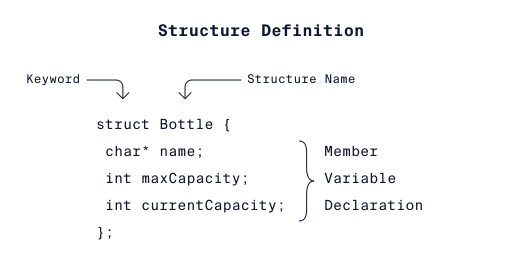

- La palabra clave ***struct*** inicia la definición del tipo de estructura.
 - Bottle es el nombre del nuevo tipo de estructura.
 - Un conjunto de llaves, {}, para encerrar las variables miembro de la estructura.
 - Dentro de las llaves, las variables miembro están "empaquetadas" juntas.