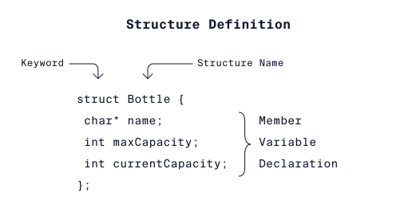

- La palabra clave ***struct*** inicia la definición del tipo de estructura.
 - Bottle es el nombre del nuevo tipo de estructura.
 - Un conjunto de llaves, {}, para encerrar las variables miembro de la estructura.
 - Dentro de las llaves, las variables miembro están "empaquetadas" juntas.

 Las variables miembro pueden ser de cualquier tipo básico (**int, char, etc.**). También pueden ser tipos derivados como matrices, punteros e incluso otras estructuras.

 Es importante tener en cuenta que las variables miembro solo deben declararse y no inicializarse.

 ## Inicializar Structures
 	struct Bottle {
 	 char* name;
 	 int maxCapacity;
 	 int currentCapacity;
	};
 
	struct Bottle bottle1 = {"superBottle", 24, 0};

El orden de los valores asignados a las variables miembro coincide con el orden en que se definieron las variables en la estructura.

Podemos iniciar los objetos desordenados.

	struct Bottle bottle1 = {
  	.maxCapacity = 24,
  	.name = "superBottle",
  	.currentCapacity = 0
	};

## Accediendo a los datos
La notación de puntos es un operador de C que permite acceder y modificar una variable miembro de una estructura.

	bottle1.currentCapacity = 10;

## Punteros de estructura

Para las estructuras, esto se logra definiendo primero la variable de estructura, luego definiendo un puntero y asignándole la dirección a la variable de estructura.

	struct Bottle myBottle = {"Medium Bottle", 24, 0};
	struct Bottle *bottlePointer = &myBottle;

Para acceder a las variables miembro con bottlePointer y el operador punto podemos usar la siguiente sintaxis:

	(*bottlePointer).name;
	(*bottlePointer).maxCapacity;
	(*bottlePointer).currentCapacity;

Cuando usamos punteros, necesitamos desreferenciar, **\***, la dirección para acceder a la variable a la que apunta.

Cuando usamos el operador de punto con punteros de estructura, también necesitamos envolver la desreferencia entre paréntesis, **()**.

Si simplemente eliminamos la referencia como ***aPointer.name**, se producirá un error.

Para mi la lo mas sencillo es realizar la notación de flecha, ya que implícitamente hace la desreferenciación.

	aPointer->name;
	aPointer->maxCapacity;
	aPointer->currentCapacity;

## Estructuras en Funciones

	void myFunction(struct Bottle b, struct Bottle* bPointer)

Al pasar una estructura a una función:

- Se hace una copia de la estructura, hay que tener cuidado con la memoria.

- Las modificaciones que se realicen en la estructura no afectarán a la estructura original, solo a la copia.

Al pasar un puntero a una estructura:

- Debido a que el puntero es la dirección de la estructura original, se modificara el original.

		void bottleFunction(struct Bottle b, struct Bottle* bPointer){
		b.name = "Super Large";
		b.maxCapacity = 100;
		bPointer->name = "Super Small";
		bPointer->maxCapacity = 4;    
		}
		
		int main(){
		struct Bottle b1 = {"Medium", 24, 9};
		struct Bottle b2 = {"Large", 35, 9};

		bottleFunction(b1, &b2);
		}