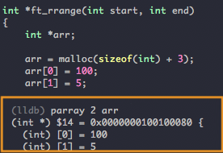
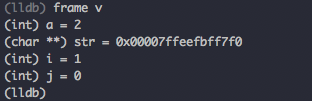
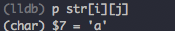

## Stepping Around
#### Step Over
	next
	n
#### Step into
	step
	s
#### Cotinue
	c
---

## Inspecting Variables
#### Print Variable Contents
	p varName
#### Frame Variables
	frame variable
	fr V
#### Current Line
	frame select
---

## Backtrace and Frames
#### Backtrace
	bt
	breakpoint set --name main
	breakpoint set --file test.c --line 12
	br s -f test.c -l 12
	b test.c:12
#### Switching Frames
	frame select o
	f 2
---

## Using Watchpoints
Program must be running in order to set the watch point.
#### Global Variable
	watchpoint set variable globalVariable
	watchpoint set variable -W read I write I read_write globalVariable
#### Member Variable
	b main
	W S V d.memberVar
	
## List Array elements
	parray <number_to_list> arr

---

 
