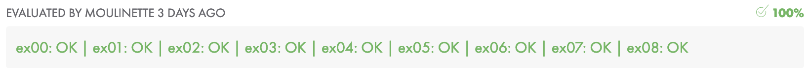

# C01

## Relas de uso PUNTEROS

 - Sīmbolo **`*`** se usa para definir un tipo de punteros para.
 - Sīmbolo **&** se usa para indica la dirección de un a varible.
 - Símbolo **`*`** se usa para acceder al valor qie guarda un puntero
 - Simbolo & en la invocación de las funciones, se pone delante de los parametros de E/S (entrada / salida)
 - Cuado un parámetro es E/S en el prototipo y cabecera se indica con un tipo de puntero, esto es poniendo un **`*`** delante del nombre.
 - en el cuerpo de la función los argumentos que son funciones se usan con un **`*`** delante **#**.

